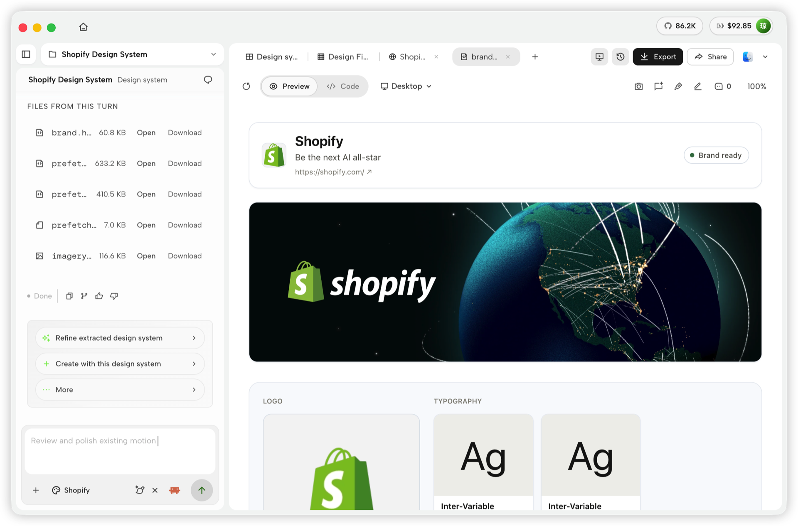
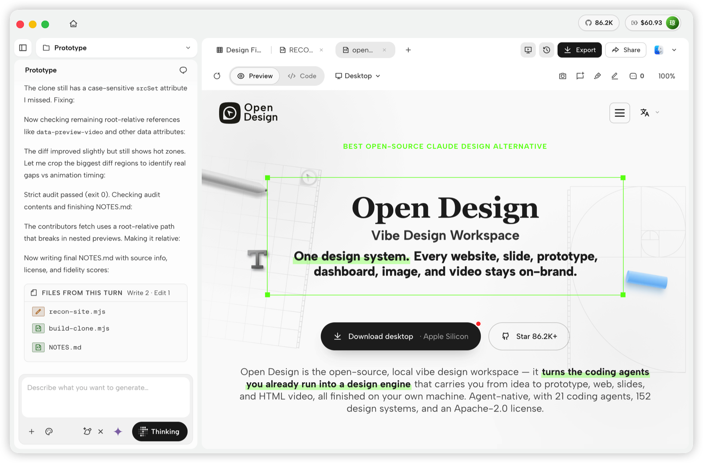
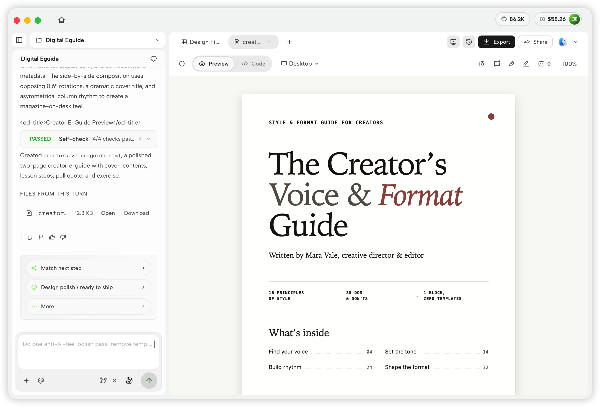

# OpenComputer Design

Local-first design studio. Paste an **Inferno** API key in Settings, write a brief, and preview the artifact on your machine.

Fork of nexu-io/open-design (Apache-2.0).

Website: [tryopencomputer.com](https://tryopencomputer.com)

<p align="center">
  <a href="https://github.com/Open-Computer-AI/OpenComputer-Design/releases"></a>
  <a href="LICENSE"></a>
  <a href="QUICKSTART.md"></a>
</p>

<p align="center"><b>English</b> · <a href="docs/i18n/README.es.md">Español</a> · <a href="docs/i18n/README.pt-BR.md">Português</a> · <a href="docs/i18n/README.de.md">Deutsch</a> · <a href="docs/i18n/README.fr.md">Français</a> · <a href="docs/i18n/README.zh-CN.md">简体中文</a> · <a href="docs/i18n/README.zh-TW.md">繁體中文</a> · <a href="docs/i18n/README.ko.md">한국어</a> · <a href="docs/i18n/README.ja-JP.md">日本語</a> · <a href="docs/i18n/README.ar.md">العربية</a> · <a href="docs/i18n/README.ru.md">Русский</a> · <a href="docs/i18n/README.uk.md">Українська</a> · <a href="docs/i18n/README.tr.md">Türkçe</a> · <a href="docs/i18n/README.th.md">ภาษาไทย</a></p>

---

## What it is

OpenComputer Design is a local web UI and daemon (`ocd`) that talks **only to Inferno** at `https://router.tryopencomputer.com/v1`. There is no Open Design Cloud, no AMR billing, and no spawned Claude Code / Codex / other coding-agent CLI in this distribution.

- **Inferno-only.** Save a key in Settings. The daemon holds the key and calls Inferno; the browser never sends it to the router.
- **CLI `ocd`.** Not `od` (macOS `/usr/bin/od`) and not `oc` (OpenComputer platform CLI).
- **Data dir** `~/.opencomputer-design`. Override with `OCD_DATA_DIR`, then `OD_DATA_DIR`. See `AGENTS.md` → **Daemon data directory contract** — this README does not restate it.
- **Studio** for prototypes, decks, documents, mobile, and HyperFrames (local HTML → MP4). Remote image/video providers are not offered.
- **Packaged app identity** is **OpenComputer Design** (`OpenComputer Design.exe` on Windows, `OpenComputer Design.app` on macOS). Internal npm packages stay `@open-design/*`.

Generate / Send stays blocked until Inferno is ready (key saved and model catalog fetched). The banner is: **Add your Inferno API key in Settings to generate.**

---

## Quick start

### Packaged desktop

Build the installer this repo ships (unsigned until you attach a cert):

```bash
# Windows NSIS → OpenComputer Design Setup
pnpm tools-pack win build --to nsis

# macOS DMG → OpenComputer Design.app
pnpm tools-pack mac build --to dmg
```

Install, launch **OpenComputer Design**, then **Settings → Inferno**, paste your API key, Save. Auto-update metadata is `https://releases.tryopencomputer.com/<channel>/latest/metadata.json` (override with `OD_UPDATE_METADATA_URL`).

GitHub Releases: [Open-Computer-AI/OpenComputer-Design](https://github.com/Open-Computer-AI/OpenComputer-Design/releases).

### Run from source

Node `~24`, pnpm `10.33.x`. Use Corepack so the pinned pnpm is selected.

```bash
git clone https://github.com/Open-Computer-AI/OpenComputer-Design.git
cd OpenComputer-Design
corepack enable
pnpm install
pnpm tools-dev run web
```

Open the URL printed by `tools-dev`. Then **Settings → Inferno**, paste your API key, Save.

WSL2: [`docs/wsl-setup.md`](docs/wsl-setup.md). Native Windows: [`docs/windows-troubleshooting.md`](docs/windows-troubleshooting.md). Full env and packaged flow → [`QUICKSTART.md`](QUICKSTART.md).

### Docker

```bash
git clone https://github.com/Open-Computer-AI/OpenComputer-Design.git
cd OpenComputer-Design/deploy
cp .env.example .env
# set OD_API_TOKEN in .env (openssl rand -hex 32)
docker compose up -d
# open http://127.0.0.1:7456
```

`OD_API_TOKEN` authenticates the daemon on non-loopback access. It is **not** the Inferno key — still paste that in Settings.

### CLI

```bash
pnpm --filter @open-design/daemon build
ocd --help
ocd mcp install <agent>   # optional: let an external MCP client read local projects
```

Internal workspace packages stay `@open-design/*`. User-facing commands are `ocd`.

---

## Product tour

Start on **Home** with a brief. Browse **Plugins** and **Design System**, then open a project's **Studio**.

<table>
<tr>
<td valign="top">
<br/>
<sub><b>Home</b> — choose an artifact type, enter a brief, and set the design system and model before you start.</sub>
</td>
</tr>
</table>

<table>
<tr>
<td width="50%" valign="top">
<br/>
<sub><b>Plugins</b> — browse official skills by category and launch a workflow with <code>Try it</code> (requires Inferno).</sub>
</td>
<td width="50%" valign="top">
<br/>
<sub><b>Design System</b> — extract and refine a brand's visual language, then create with it in the same workspace.</sub>
</td>
</tr>
</table>

### Studio

<table>
<tr>
<td width="50%" valign="top">
<br/>
<sub><b>Prototype</b> — generate web experiences, inspect the rendered page, iterate in place.</sub>
</td>
<td width="50%" valign="top">
<br/>
<sub><b>Deck</b> — multi-slide presentations, thumbnails, speaker notes, export.</sub>
</td>
</tr>
<tr>
<td width="50%" valign="top">
<br/>
<sub><b>Mobile app</b> — device-framed interfaces with conversation and files beside the preview.</sub>
</td>
<td width="50%" valign="top">
<br/>
<sub><b>Document</b> — multi-page guides and editorial documents.</sub>
</td>
</tr>
<tr>
<td width="50%" valign="top">
<br/>
<sub><b>HyperFrame</b> — code-driven motion graphics, preview in Studio, export MP4 locally.</sub>
</td>
<td width="50%" valign="top">
<br/>
<sub><b>Files</b> — conversation, generated files, and live preview stay together.</sub>
</td>
</tr>
</table>

---

## Inferno

| Field | Value |
|---|---|
| Display name | Inferno |
| Base URL | `https://router.tryopencomputer.com/v1` (hardcoded, not editable) |
| Auth | `Authorization: Bearer <key>` stored only in the daemon credential store |
| Models | `GET /v1/models` after Save |
| Chat | Daemon `POST /api/proxy/inferno/stream` → streamed text → `<artifact>` blocks written to project files |

Typed failures stay Inferno failures (`INFERNO_KEY_REQUIRED`, `INFERNO_NOT_READY`, `INFERNO_KEY_REJECTED`, `INFERNO_RATE_LIMITED`, `INFERNO_UNAVAILABLE`, `INFERNO_MODEL_UNREACHABLE`). Copy does not suggest another provider.

---

## Skills, templates, design systems, plugins

**Functional skills** live in [`skills/`](skills/) (`SKILL.md`). **Rendering templates** live in [`design-templates/`](design-templates/) (`prototype`, `deck`, plus HyperFrames). **Design systems** are `DESIGN.md` packages under [`design-systems/`](design-systems/). **Plugins** are portable directories under [`plugins/_official/`](plugins/_official/) and [`plugins/community/`](plugins/community/).

```bash
ocd plugin list
ocd plugin search "landing page"
ocd skills list --json
ocd design-systems list --json
```

Protocol → [`docs/skills-protocol.md`](docs/skills-protocol.md). Plugin spec → [`plugins/spec/SPEC.md`](plugins/spec/SPEC.md).

MCP is still available so **external** tools can read local projects (`ocd mcp install <agent>`). That does not re-enable those agents inside this app.

---

## Architecture

```
┌────────────── browser (Next.js) / Electron shell ──────────────┐
│  chat · files · iframe preview · settings (Inferno key)        │
└────────────────────────────┬───────────────────────────────────┘
                             │ /api/*
                             ▼
                  local daemon (ocd)
           Express + SQLite + Inferno proxy
                             │
                             ▼
              router.tryopencomputer.com
                    (HTTPS only)
```

| Layer | Stack |
|---|---|
| Frontend | Next.js App Router + React + TypeScript |
| Desktop | Electron · NSIS (Windows) · DMG (macOS) · product name **OpenComputer Design** |
| Daemon | Node 24 · Express · SSE · `better-sqlite3` |
| Storage | `AGENTS.md` → **Daemon data directory contract** |
| Preview | `<artifact>` blocks → project files → sandboxed iframe |
| Export | HTML · PDF · PPTX · ZIP · Markdown · MP4 (HyperFrames) |
| Lifecycle | `pnpm tools-dev` (dev) · `pnpm tools-pack` (installers) |

Full architecture → [`docs/architecture.md`](docs/architecture.md).

Telemetry is **off** by default (`telemetry.metrics: false`). Settings → Privacy can opt in; there is no PostHog/GA script inject unless a key is present **and** you opt in.

---

## Contributing

```bash
corepack enable
pnpm install
pnpm tools-dev run web
pnpm guard
pnpm --filter @open-design/daemon exec vitest run -c vitest.config.ts tests/inferno-string-sweep.test.ts
```

See [`CONTRIBUTING.md`](CONTRIBUTING.md) and [`AGENTS.md`](AGENTS.md).

## License

Apache-2.0. Keep original copyright notices. Bundled skills and templates with their own `LICENSE` files retain those licenses, including `design-templates/guizang-ppt/` (MIT), `design-templates/html-ppt/` (MIT), and `skills/web-clone/` (MIT).
